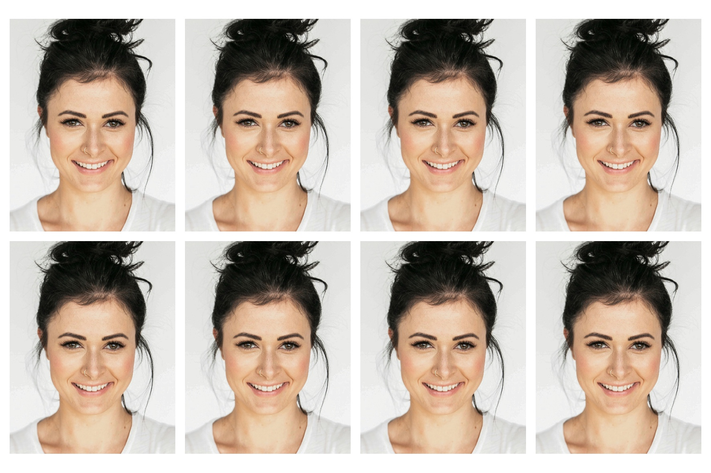

# Passport Photo Generator

A configurable, automatic passport photo generator that supports different countries' passport photo requirements. Uses advanced face detection and alignment to create professional passport photos that meet official standards.



## Features

- **Automatic face detection and alignment** using the Pigo face detection library
- **Configurable for different countries** - easily adapt for US, UK, Canada, India, and more
- **Dynamic layout calculation** - automatically optimizes photo placement for any paper size
- **Austrian/EU standard by default** (35×45mm photos)
- **Multiple print formats** - 10×15cm, 13×18cm, and custom sizes
- **High-quality output** - 300 DPI professional printing quality
- **EXIF orientation handling** - automatically corrects image rotation
- **Command line and interactive modes**

## Quick Start

### Prerequisites

1. **Go 1.19 or later**
2. **Face detection model** - Download with:
   ```bash
   curl -L https://github.com/esimov/pigo/raw/master/cascade/facefinder -o facefinder
   ```

### Installation

```bash
git clone https://github.com/Gitsack/passport-image-generator
cd passport-image-generator
go mod tidy
```

### Basic Usage

```bash
# Use default format (10x15cm, 8 photos)
go run main.go photo.jpg

# Specify format
go run main.go photo.jpg 10x15    # 10x15cm format (8 photos)
go run main.go photo.jpg 13x18    # 13x18cm format (9 photos)

# Interactive mode
go run main.go
```

## Configuration for Different Countries

The generator is easily configurable for different countries' passport photo requirements. See [CONFIGURATION.md](CONFIGURATION.md) for detailed instructions.

### Quick Configuration Examples

**United States (2×2 inches):**
```go
PHOTO_WIDTH_MM = 51; PHOTO_HEIGHT_MM = 51
PHOTO_WIDTH_PX = 602; PHOTO_HEIGHT_PX = 602
HEAD_HEIGHT_RATIO = 0.60
```

**United Kingdom (45×35mm landscape):**
```go
PHOTO_WIDTH_MM = 45; PHOTO_HEIGHT_MM = 35
PHOTO_WIDTH_PX = 531; PHOTO_HEIGHT_PX = 413
HEAD_HEIGHT_RATIO = 0.75
```

**Canada (50×70mm):**
```go
PHOTO_WIDTH_MM = 50; PHOTO_HEIGHT_MM = 70
PHOTO_WIDTH_PX = 591; PHOTO_HEIGHT_PX = 827
HEAD_HEIGHT_RATIO = 0.50
```

## Current Configuration (Austrian/EU Standard)

- **Photo size:** 35×45mm (413×531 pixels at 300 DPI)
- **Head height:** 75% of photo height (chin to skull)
- **Eye position:** 48% from top of photo
- **Headspace:** 10% above head
- **Print formats:** 10×15cm (8 photos), 13×18cm (9 photos), custom sizes

## Output

The generator creates:
- **Passport photo layout** - Multiple photos arranged for printing
- **Detailed measurements** - Console output with specifications

### Example Output
```
📏 Passport photo specifications:
   - Photo size: 35x45mm (413x531 pixels at 300 DPI)
   - Head height (chin-to-skull): 398 pixels (75.0% of 531)
   - Eyes position: 255 pixels from top (48.0% of 531)
   - Headspace above head: 53 pixels (10.0% of 531)

📄 Creating 10x15cm (8 photos) layout (4x2 grid)
📐 Grid layout: start=(24,47), spacing=2.0mm, margin=2.0mm
✅ Placed 8 photos successfully
```

## Technical Details

### Face Detection
- Uses the Pigo face detection library for accurate face recognition
- Automatically handles different face sizes and positions
- Fallback to smart center crop if face detection fails

### Image Processing
- **High-quality resizing** with bilinear interpolation
- **EXIF orientation correction** for proper image rotation
- **Professional print quality** at 300 DPI
- **Precise measurements** following passport photo standards

### Layout Algorithm
- **Dynamic calculation** for optimal photo placement
- **Maximum utilization** of paper space
- **Configurable spacing** between photos for cutting
- **No-cropping policy** ensures all photos fit completely

## Dependencies

- `github.com/esimov/pigo/core` - Face detection
- `github.com/rwcarlsen/goexif/exif` - EXIF data handling

## File Structure

```
passport-image-generator/
├── main.go              # Main application
├── facefinder           # Face detection model
├── CONFIGURATION.md     # Detailed configuration guide
├── README.md           # This file
└── go.mod              # Go module definition
```

## Contributing

1. Fork the repository
2. Create a feature branch
3. Make your changes
4. Test with multiple sample images
5. Update documentation if needed
6. Submit a pull request

### Adding Support for New Countries

1. Research official passport photo requirements
2. Add configuration example to [CONFIGURATION.md](CONFIGURATION.md)
3. Test with sample images
4. Document any special considerations

## License

This project is open source. Please check the license file for details.

## Troubleshooting

### Common Issues

**Face not detected:**
- Ensure good lighting and clear face visibility
- Check that the `facefinder` model file is present
- The program will fall back to smart center crop

**Photos too small/large:**
- Adjust `HEAD_HEIGHT_RATIO` in the configuration
- Check that pixel dimensions match millimeter dimensions

**Layout issues:**
- Verify `MIN_SPACING_MM` setting
- Check paper size calculations
- Ensure photos fit within paper boundaries

### Getting Help

1. Check the [CONFIGURATION.md](CONFIGURATION.md) guide
2. Review the console output for detailed measurements
3. Test with the provided sample images
4. Open an issue with sample images and configuration details

## Acknowledgments

- Pigo face detection library by Endre Simo
- Go EXIF library by Ryan Carlsen
- Austrian passport photo standards for reference implementation
- Sample photo by <a href="https://unsplash.com/@jakenackos?utm_content=creditCopyText&utm_medium=referral&utm_source=unsplash">Jake Nackos</a> on <a href="https://unsplash.com/photos/woman-in-white-crew-neck-shirt-smiling-IF9TK5Uy-KI?utm_content=creditCopyText&utm_medium=referral&utm_source=unsplash">Unsplash</a>
      